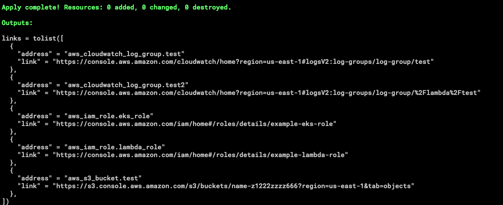

# AWS Console Link Generator

This project parses **Terraform state JSON** to extract and print AWS Console links for resources managed by Terraform. It currently supports the **AWS provider** and focuses on generating convenient links for easy navigation to AWS resources in the console.

## Features

- Parses **Terraform state JSON** files to identify AWS resources.
- Generates **AWS Console links** for supported resource types.
- Simple and intuitive output for quick navigation.
- Supports filtering by specific resource types or names.

## Supported Providers

- **AWS** (current support only).

## Usage

[See examples](./examples/complete)

## Limitations

- **Provider Support**: Currently, only the AWS provider is supported. Other cloud providers may be added in the future.
- **Resource Types**: Not all AWS resource types may have link generation logic implemented yet.

## Contributing

We welcome contributions to improve this project, including:
- Adding support for more AWS resource types.
- Extending functionality to support additional Terraform providers.

Feel free to open issues or submit pull requests!

